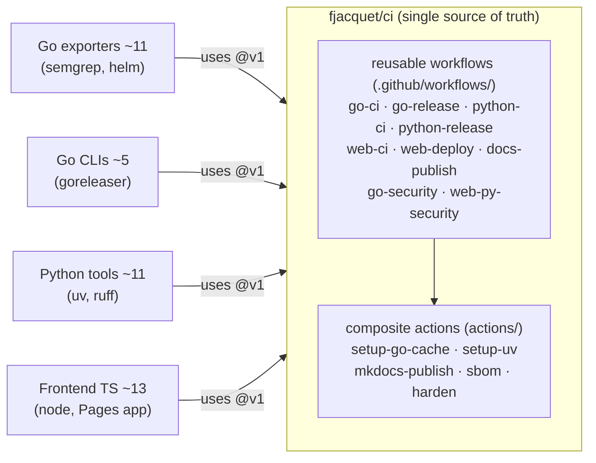

# CI/CD Standardization — Design

- **Status:** Approved (brainstorming) — ready for implementation planning
- **Date:** 2026-06-19
- **Owner:** Frederic Jacquet (`fjacquet`)
- **Central repo:** `fjacquet/ci` (this repo)

---

## 1. Context & motivation

An audit across ~50 owned GitHub repos with CI/CD revealed convergent **naming**
(`ci.yml` / `docs.yml` / `release.yml`) but divergent **contents** — the same
intent is hand-tweaked per repo. Concrete findings:

- **Heavy builder version drift.** Same actions pinned at many versions across the
  fleet: `actions/checkout` at v2/v3/v4/v6 (+SHAs); `setup-go` at v5/v6;
  `setup-python` at v4/v5/v6; `astral-sh/setup-uv` at v2/v5/v7; `goreleaser-action`
  and `deploy-pages` mixed v4/v5/v6.
- **Inconsistent security posture.** A subset is SHA-pinned (OSSF/SLSA + Dependabot
  origin); most float on tags. No single policy.
- **Scattered security scanners.** semgrep on 10 Go exporters; CodeQL on 7 mixed;
  trivy on 3; osv-scanner on 4; sonar on 4; SBOM/syft on ~21. No coherent baseline.
- **Two distinct gh-pages uses.** Frontend repos deploy the *application* to Pages;
  Go/Python repos deploy *mkdocs docs* to Pages.
- **Docs tooling is de-facto mkdocs** (20 repos have `mkdocs.yml`); only 2 still use
  Jekyll (`para-files`, `pdf2md`).
- **Go release is already consistent** — 15 repos use **goreleaser**.

The duplication and drift are real and worth standardizing into a single source of
truth, with the **latest builders** and **CI best practices** applied uniformly.

## 2. Goals & non-goals

### Goals
- One source of truth for CI/CD logic, eliminating per-repo YAML duplication.
- Converge every repo onto the **latest builder versions**.
- Apply **CI best practices** uniformly (least-privilege, pinning, hardening).
- Reduce each repo's workflow files to thin (~6-line) callers.
- Centralize action-version maintenance to a single Dependabot stream.

### Non-goals
- Migrating upstream **forks** (`cui`, `stash`, `sdw`, `stable-diffusion-webui`,
  `external-snapshotter`, `packer-plugin-utm`, `cfg2html`) — out of scope.
- Changing application/test code. This is strictly CI/CD plumbing.
- Unifying the SAST engine across archetypes (explicitly rejected — see Decision D5).

## 3. Locked decisions

| # | Decision | Choice | Rationale |
|---|----------|--------|-----------|
| D1 | **Scope** | Active owned repos, all 4 archetypes | Forks & dormant repos excluded. |
| D2 | **Mechanism** | Hybrid: reusable workflows (`workflow_call`) + composite actions for cross-archetype shared steps | Best DRY; collapses drift to one repo. |
| D3 | **Version pinning** | Third-party actions **SHA-pinned + Dependabot** inside `fjacquet/ci`; callers reference `fjacquet/ci` by moving tag `@v1` | Reproducible & supply-chain-hardened; churn centralized to one repo. Best practice: pin third-party by SHA, first-party-you-control by release tag. |
| D4 | **Best practices** | Applied to every job: least-privilege `permissions`, `concurrency` cancel-in-progress, `timeout-minutes`, `persist-credentials: false`, pinned `runs-on: ubuntu-24.04` | Explicit user requirement. |
| D5 | **Security baseline** | Best-of-breed **per archetype**: `go-security` = semgrep + SBOM; `web-py-security` = CodeQL + osv-scanner + SBOM. Both add `harden-runner` | Minimal migration churn; keep what's wired, fix the hygiene. |
| D6 | **Central repo** | `fjacquet/ci` (dedicated, public) | No community-health side effects; single purpose. |
| D7 | **Docs tooling** | Standardize on **mkdocs-material**; migrate `para-files` + `pdf2md` off Jekyll | mkdocs already the de-facto standard (20 repos). |
| D8 | **Build interface** | **Go + Python: pure Makefile.** Reusable workflows call `make <target>` for the entire build (incl. release, coverage, sbom, docs, security). **Frontend: npm-native** (workflows call npm scripts directly). Canonical `Makefile.go`/`Makefile.python` templates in `fjacquet/ci/templates/`; every Go/Py repo exposes the same target set (`all clean install tools lint format test build vuln sbom security docs coverage-upload release ci`). | `make` target names become the standardization contract; `pscale_exporter` already works this way. Frontend keeps npm scripts (idiomatic). See the Makefile amendment plan. |

## 4. Target architecture



### Repo layout (`fjacquet/ci`)
```
fjacquet/ci/
  .github/
    workflows/            # reusable workflows (workflow_call)
      go-ci.yml
      go-release.yml
      python-ci.yml
      python-release.yml
      web-ci.yml
      web-deploy.yml
      docs-publish.yml
      go-security.yml
      web-py-security.yml
    dependabot.yml        # watches github-actions in this repo
  actions/                # composite actions (cross-archetype shared steps)
    setup-go-cache/action.yml
    setup-uv/action.yml
    mkdocs-publish/action.yml
    sbom/action.yml
    harden/action.yml
  DESIGN.md               # this document
  README.md               # usage + versioning policy
```

## 5. Reusable workflows (detailed)

Each defines `on: workflow_call` with typed `inputs`, declares minimal
`permissions`, sets `concurrency`, `timeout-minutes`, and pins `ubuntu-24.04`.

| Workflow | Inputs (key) | Jobs / steps | Used by |
|----------|--------------|--------------|---------|
| `go-ci` | `go-version`, `golangci-version` | golangci-lint → `go test -race` + coverage (codecov) → `go build` | Go exporters + CLIs |
| `go-release` | `goreleaser-version`, `helm: bool` | goreleaser → GitHub release; optional helm-charts publish | Go exporters + CLIs |
| `python-ci` | `python-version`, `uv-version` | `setup-uv` → ruff check + format --check → pytest + coverage | Python tools |
| `python-release` | `environment` | `uv build` → PyPI via OIDC trusted publishing | opt-in (today: `code-review-graph`) |
| `web-ci` | `node-version`, `package-manager` | install → lint → build → optional vitest/playwright | Frontend TS |
| `web-deploy` | `build-dir`, `node-version` | build → `upload-pages-artifact` → `deploy-pages` (the **app**) | Frontend TS |
| `docs-publish` | `python-version` | `mkdocs-publish` composite → Pages (the **docs**) | Go + Python |
| `go-security` | — | semgrep → `sbom` composite → `harden` | Go |
| `web-py-security` | `languages` | CodeQL → osv-scanner → `sbom` → `harden` | Frontend + Python |

### Standard builder versions (converge fleet to these latest majors)
`actions/checkout@v6`, `actions/setup-go@v6`, `actions/setup-python@v6`,
`actions/setup-node@v6`, `astral-sh/setup-uv@v7`, `actions/upload-artifact@v7`,
`actions/download-artifact@v8`, `actions/configure-pages@v6`,
`actions/upload-pages-artifact@v5`, `actions/deploy-pages@v5`,
`goreleaser/goreleaser-action@v6`, `codecov/codecov-action@v6`.
All recorded as **full commit SHAs** with a `# vX.Y.Z` trailing comment.

## 6. Composite actions (cross-archetype shared steps)

Extracted only where used by **more than one** reusable workflow:

- **`setup-go-cache`** — `setup-go` + module/build cache (go-ci, go-release).
- **`setup-uv`** — `setup-uv` + Python + cache (python-ci, python-release, docs-publish).
- **`mkdocs-publish`** — build mkdocs-material → Pages artifact → deploy
  (identical for Go and Python docs).
- **`sbom`** — anchore/syft SBOM → SPDX artifact (go-security, web-py-security).
- **`harden`** — step-security `harden-runner` egress audit (both security workflows).

## 7. Caller pattern (what lands in each repo)

Every repo keeps the de-facto names but each file becomes a thin caller:

```yaml
# go repo — .github/workflows/ci.yml  (entire file)
name: CI
on:
  push: { branches: [main] }
  pull_request:
permissions:
  contents: read
jobs:
  ci:
    uses: fjacquet/ci/.github/workflows/go-ci.yml@v1
    with:
      go-version: "1.23"
```

```yaml
# python repo — .github/workflows/ci.yml
jobs:
  ci:
    uses: fjacquet/ci/.github/workflows/python-ci.yml@v1
    with: { python-version: "3.13" }
```

```yaml
# frontend repo — .github/workflows/deploy.yml
permissions:
  pages: write
  id-token: write
jobs:
  deploy:
    uses: fjacquet/ci/.github/workflows/web-deploy.yml@v1
```

## 8. Repo inventory (best-effort — Phase 0 confirms)

> The authoritative classification table is produced in **Phase 0**. Below is the
> working assignment; repos marked `*` need verification.

- **Go exporters (~11):** `cee-exporter`, `ecs_exporter` (→ `obs_exporter`),
  `idrac_exporter`*, `nbu_exporter`, `nsr_exporter`, `pflex_exporter`,
  `pmax_exporter`, `ppdd_exporter`, `ppdm_exporter`, `pscale_exporter`,
  `pstore_exporter`.
- **Go CLIs (~5):** `camt-csv`, `go-evtx`, `pdf2md`, `san-conv`, `spec-search`.
- **Python tools (~11):** `finwiz`, `classifai`, `anki-maker`, `mailtag`,
  `lrc-automation`, `code-review-graph` (PyPI), `Nano-Banana-MCP`,
  `store-predict`*, `ppdm-report`*, `ppdm2jira`* (no CI yet), `vault-rag-mcp`
  (no CI yet — greenfield).
- **Frontend TS (~13):** `elk-sizer`, `network-sizer`, `os-sizer`, `vcf-sizer`,
  `vsizer`, `icons`, `360gantt`, `converty`, `llmvram`, `presizion`, `raidy`,
  `vatlas`, `vgpu-advisor`. Of these, `vgpu-advisor` (and the TS MCP server
  `brave-search-mcp-server`*) **publish to npm** rather than (or in addition to)
  Pages — see npm-publish Open item.
- **Excluded forks:** `cui`, `stash`, `sdw`, `stable-diffusion-webui`,
  `external-snapshotter`, `packer-plugin-utm`, `cfg2html`.

## 9. Migration & rollout

1. **Phase 0 — Audit.** Produce the authoritative inventory table (repo, archetype,
   current builders/versions, publish target, scanners, fork?, active?). Resolve the
   `*` repos and the npm-publish question (see Open items).
2. **Phase 1 — Build `fjacquet/ci`.** Author all reusable workflows + composite
   actions, SHA-pinned, with `dependabot.yml` and `README.md`. Tag `v1`.
3. **Phase 2 — Pilot.** Migrate one repo per archetype — `pscale_exporter`,
   `camt-csv`, `finwiz`, `vsizer` — validate green, refine workflow interfaces, then
   re-tag `v1`.
4. **Phase 3 — Fleet rollout.** Batch-migrate the rest via per-repo PRs; delete
   superseded YAML. Group by archetype to reuse review effort.
5. **Phase 4 — Cleanup.** Migrate `para-files` + `pdf2md` off Jekyll to mkdocs;
   retire redundant `sonar` workflows; add CI to greenfield repos
   (`vault-rag-mcp`, `ppdm2jira`).

## 10. Open items (resolve in Phase 0)

- Confirm `idrac_exporter` is owned vs an upstream fork (affects inclusion).
- Confirm archetype of `store-predict`, `ppdm-report`, `ppdm2jira`.
- **npm package publishing:** `brave-search-mcp-server` and `vgpu-advisor` publish to
  npm. Decide whether to add a small `web-release` (npm publish) reusable workflow or
  fold a `publish: bool` input into `web-ci`/`web-deploy`.
- Confirm whether any frontend repo also needs a docs site (most don't).
- Confirm Go/Python/Node default versions to pin as workflow input defaults.

## 11. Risks & mitigations

- **Breaking change to a reusable workflow breaks the fleet at once.** Mitigation:
  callers pin `@v1`; breaking changes ship as `v2`; pilot validates before re-tag.
- **OIDC/Pages permission gaps** when callers forget to grant `permissions`.
  Mitigation: document required `permissions` per workflow in `README.md`; reusable
  workflows declare their own minimal `permissions`.
- **Hidden per-repo special-casing** lost in migration. Mitigation: Phase 0 inventory
  captures deviations; pilot surfaces them before fleet rollout.
- **Security scanning generated as code** must be scanned with semgrep before
  deployment (per project security policy) during Phase 1.

## 12. Success criteria

- Every in-scope repo's `ci`/`release`/`docs`/`security` workflows are thin callers
  to `fjacquet/ci@v1`.
- Zero builder-version drift: one version per action, maintained by one Dependabot.
- All jobs carry least-privilege `permissions`, `concurrency`, `timeout-minutes`.
- `para-files` and `pdf2md` build docs via mkdocs.
- A single PR to `fjacquet/ci` can bump a builder version fleet-wide.
